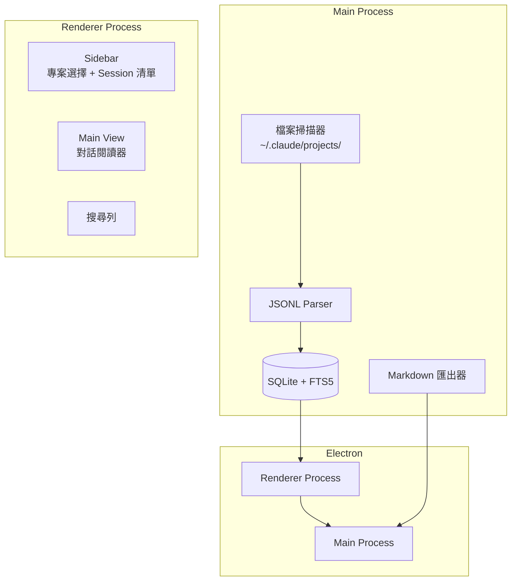

# ccRewind

Claude Code 對話回放與考古工具——輕量、只讀、離線優先的桌面應用程式，讓你回顧與 Claude Code 的每一次協作對話。

不做 AI 摘要、不做 context injection、不做 RAG。讓資料自己說話。

## 系統架構



## 技術棧

| 技術 | 用途 | 版本建議 |
|------|------|----------|
| Electron | 桌面應用框架 | ^33 |
| React | UI 框架 | ^19 |
| TypeScript | 型別安全 | ^5.5 |
| better-sqlite3 | SQLite binding（含 FTS5） | ^11 |
| Vite | 前端建構工具 | ^6 |
| electron-builder | 打包發布 | ^25 |

## 安裝指引

### 前置需求

- Node.js >= 20
- pnpm >= 9

### 開發環境

```bash
git clone https://github.com/tznthou/ccRewind.git
cd ccRewind
pnpm install
pnpm dev
```

### 建構發布

```bash
pnpm build
pnpm dist
```

## 專案結構

```
ccRewind/
├── src/
│   ├── main/                  # Electron main process
│   │   ├── index.ts           # 應用程式入口
│   │   ├── scanner.ts         # 專案 / session 檔案掃描
│   │   ├── parser.ts          # JSONL 解析器
│   │   ├── database.ts        # SQLite + FTS5 管理
│   │   ├── exporter.ts        # Markdown 匯出
│   │   └── ipc-handlers.ts    # IPC 通訊處理
│   ├── renderer/              # React 前端
│   │   ├── App.tsx            # 根元件
│   │   ├── components/
│   │   │   ├── Sidebar/       # 專案選擇 + Session 清單
│   │   │   ├── ChatView/      # 對話閱讀器
│   │   │   └── SearchBar/     # 全文搜尋
│   │   ├── hooks/             # 自定義 hooks
│   │   └── types/             # TypeScript 型別定義
│   └── shared/                # 主程序與渲染程序共用型別
│       └── types.ts
├── docs/                      # 專案文件
│   ├── PRD.md
│   ├── SPEC.md
│   └── PLAN.md
├── electron-builder.yml       # 打包設定
├── CLAUDE.md
└── package.json
```

## 定位

ccRewind 是 Claude Code 的「對話考古學工具」。與 claude-mem 等記憶系統不同，ccRewind 專注於：

- **閱讀**，不是注入——回顧過去的對話，不干預未來的對話
- **輕量**，不是全能——專注做好瀏覽和搜尋，不做 AI 分析
- **離線**，不是雲端——所有資料來自本地 `~/.claude/` 目錄
