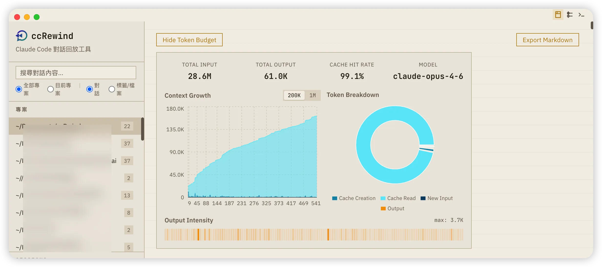
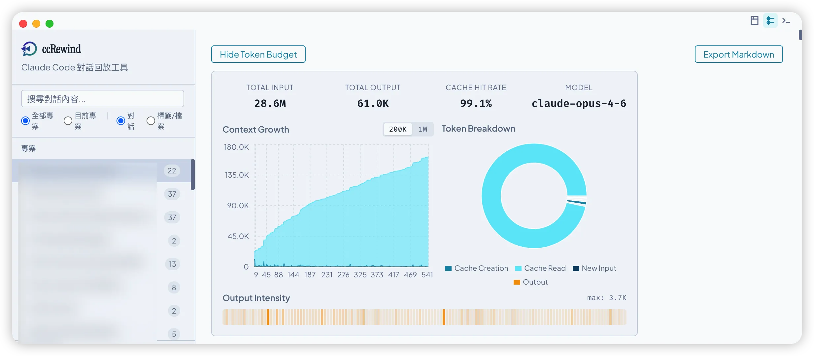
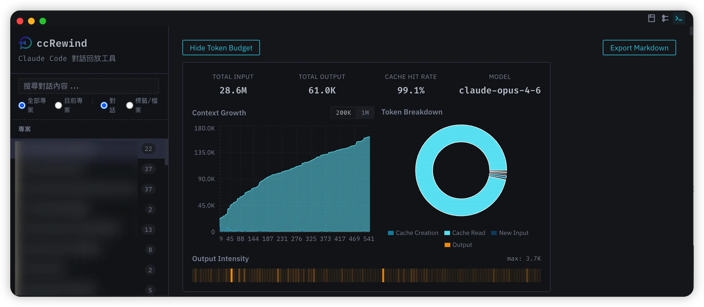
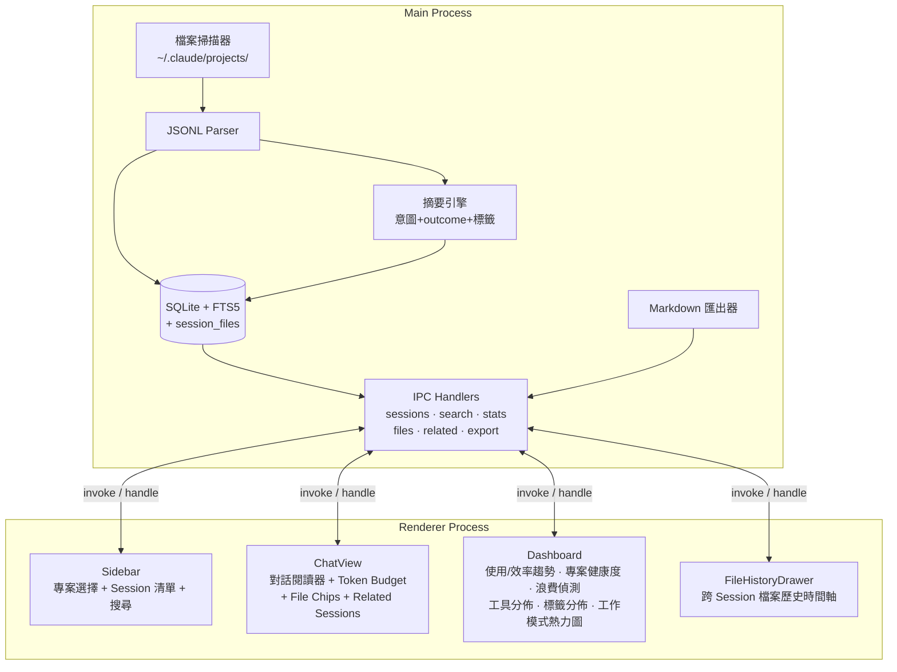

# ccRewind

[](https://www.gnu.org/licenses/agpl-3.0)
[](https://www.typescriptlang.org/)
[](https://reactjs.org/)
[](https://www.electronjs.org/)

[English](README_EN.md)

Claude Code 對話回放與考古工具。輕量、只讀、離線優先的桌面應用程式，讓你回顧跟 Claude Code 的每一次協作對話。

<p align="center">
  
</p>

<p align="center">
  
  
</p>

### 三種佈景主題 × Context Budget 儀表板

一鍵切換三種視覺風格，搭配內建 Token 用量儀表板，對話考古也可以很有氛圍感。

<table>
  <tr>
    <td align="center"><strong>📂 檔案室 Archive</strong></td>
    <td align="center"><strong>🕐 時間線 Timeline</strong></td>
    <td align="center"><strong>💻 終端回憶 Terminal</strong></td>
  </tr>
  <tr>
    <td></td>
    <td></td>
    <td></td>
  </tr>
</table>

---

## 核心概念

ccRewind 讀取 `~/.claude/projects/` 下的 JSONL 對話紀錄，建立 SQLite + FTS5 索引，提供瀏覽、搜尋、匯出功能。

Session 摘要由結構化規則引擎產生（意圖提取 + 動作概要 + outcome 推斷），零 API 成本。標籤透過文字、路徑、工具模式三軌交叉推斷。未來規劃 BYOK（自備 API Key）模式，可以選擇用 LLM 產生更高品質的摘要。

所有操作都是唯讀的。ccRewind 絕不修改 `~/.claude/` 下的任何檔案，你的對話紀錄、記憶檔案、設定檔，一個位元組都不會動。

Claude Code 刪除 Session 後，ccRewind 會自動封存該筆對話。所有訊息、標籤、摘要都留在 SQLite 裡，不會隨 JSONL 檔案消失。

---

## 功能特色

| 功能 | 說明 |
|------|------|
| **對話瀏覽** | user/assistant 氣泡介面，Markdown 渲染 + 程式碼語法高亮 |
| **三主題切換** | 檔案室（Archive）、時間線（Timeline）、終端回憶（Terminal），一鍵切換 |
| **Tool 摺疊** | tool_use / tool_result 預設摺疊，點擊展開查看完整內容 |
| **Session 自動摘要** | 結構化摘要引擎：意圖提取（跳過 greeting）、動作概要（Edit×8, 5 files）、outcome 推斷（committed/tested/in-progress）、20+ 條多信號標籤 |
| **檔案反向索引** | 每個 session 操作了哪些檔案、什麼操作（read/edit/write），可點擊檔案追蹤跨 session 歷史 |
| **全文搜尋** | FTS5 索引，分頁載入，結果按 Session 分組，支援「對話」與「標籤/檔案」兩種搜尋模式，可依日期範圍過濾（7天/30天/90天）、切換相關性或時間排序 |
| **搜尋上下文預覽** | 搜尋結果可展開顯示前後 2 則訊息，不用跳轉就能快速判斷相關性。結果顯示 Session 日期與 outcome 狀態 badge |
| **資料保全** | JSONL 被刪除時自動封存對話，不丟失任何歷史紀錄 |
| **Markdown 匯出** | 一鍵將 Session 匯出為 `.md` 檔案，含 Metadata 表格 + Tool 摺疊 |
| **Context Budget 視覺化** | Token 用量追蹤：堆疊面積圖、圓餅圖、熱力條，一眼看出每個 Session 燒了多少 token、cache 命中率多高 |
| **Token Insights** | 自動解讀圖表：偵測 context spike 並歸因、評估 cache 效率、標記 output 熱點、分析成長趨勢，讓圖表不只好看還能看懂 |
| **Token 熱力指示** | Assistant 訊息左側色碼條（綠=cache 命中佳、紅=高成本），Session 列表顯示 token 總量並可依 token 排序 |
| **統計儀表板** | 跨 session 分析：使用趨勢（雙軸面積圖）、效率趨勢（tokens/turn）、浪費偵測（高 token 低產出 session 一鍵跳轉）、專案健康度（outcome 堆疊條 + 趨勢箭頭）、工具/標籤分佈、工作模式熱力圖 |
| **跨 Session 考古** | 檔案歷史抽屜（點檔案看它在哪些 session 出現過）、相關 Session 推薦（Jaccard 相似度）、可展開 File Chips |
| **更新通知** | 啟動時自動偵測 GitHub 新版本，一鍵開啟下載頁面 |
| **Active Time** | Session 時長優先顯示活動時間（排除 >5 分鐘閒置），括號附註掛鐘時間。儀表板平均時長同步使用 active time |
| **Subagent 索引** | 自動掃描 `subagents/*.jsonl` 子代理對話紀錄並建立索引，支援 `*.meta.json` agent type 標記，增量索引 + 磁碟刪除自動清理 |
| **增量索引** | 首次啟動掃描所有 JSONL，後續僅處理新增/修改的檔案。Resumed session 自動 UUID 去重，不產生重複訊息 |
| **DB 自動遷移** | schema 變更時自動升級，大型資料庫無痛升版 |
| **虛擬捲動** | 大量 Session 不卡頓（@tanstack/react-virtual） |
| **無障礙** | WCAG 2.1 AA 對比度、ARIA 標籤、鍵盤導覽、焦點管理 |

---

## 使用說明

### Session 摘要與標籤

每個 Session 在索引時會自動產生結構化摘要：

- **意圖提取**：跳過 greeting（"hey"、"ok"）和 continuation（"continue"、"go ahead"），找到第一句實質內容作為 Session 標題
- **動作概要**：從工具使用統計生成（如 `Edit×8, 5 files`），一眼看出這次 session 的工作量
- **Outcome 推斷**：分析最後幾輪的工具模式，推斷 session 結果——`committed`（有 git commit）、`tested`（跑了測試）、`in-progress`（還在改）、`quick-qa`（快問快答）
- **多信號標籤**：三軌交叉推斷——文字 regex（20+ 條）、路徑推斷（改 `.css` → ui、改 `test/` → testing）、工具模式推斷（大量 Read + 少量 Edit → code-review）
- **涉及檔案**：從 tool_use 提取，區分操作類型（read/edit/write vs discovery），自動過濾 node_modules 等噪音路徑
- **工具統計**：顯示 `Read:15, Edit:8, Bash:5` 這類使用頻率

Outcome badge、標籤、檔案數、session 時長會直接顯示在 Session 列表項目上，不需要點進去就能掌握每個 Session 的性質和結果。

### 搜尋

ccRewind 提供兩種搜尋模式，在搜尋列右側的 radio 按鈕切換：

- **對話**（預設）：搜尋訊息內容，結果按 Session 分組。每筆結果左側有 ▸ 按鈕，點擊展開前後 2 則訊息的上下文預覽，不用跳轉就能判斷相關性
- **標籤/檔案**：搜尋 Session 的標題、標籤、涉及檔案路徑、摘要和意圖。適合「我上次改 auth.ts 是哪個 Session？」或「所有標記為 bug-fix 的對話」這類查詢

搜尋列下方提供篩選控制：

- **日期範圍**：不限 / 7 天 / 30 天 / 90 天，快速縮小搜尋範圍
- **排序方式**：相關性（FTS5 rank）或最新優先（時間倒序），切換後自動重新搜尋

兩種模式都支援「全部專案 / 目前專案」範圍篩選。搜尋結果群組顯示 Session 日期，Session 搜尋結果額外顯示 outcome 狀態 badge。

### Context Budget

進入任何 Session 後，點擊頂部 **Show Token Budget** 按鈕即可展開面板：

- **Summary Cards**：Total Input / Total Output / Cache Hit Rate / Model(s)，多模型 Session 會顯示各自佔比
- **Context Growth 面積圖**：逐 turn 的 context 大小堆疊圖（New Input / Cache Creation / Cache Read），可切換 200K / 1M 參考線
- **Token Breakdown 圓餅圖**：整個 Session 的 token 類型佔比
- **Output Intensity 熱力條**：每個 turn 的 output token 強度，快速辨識「哪個 turn 讓 Claude 寫最多東西」
- **Insights 洞察面板**：自動解讀上方圖表，告訴你「這數字好不好、為什麼、該怎麼做」——偵測 context spike 並歸因到具體 tool、評估 cache 命中效率、標記 output 最密集的 turn、分析前後半段成長趨勢

訊息列表中，每個 assistant 訊息左側會顯示色碼指示：綠色代表 cache 命中良好，紅色代表該 turn 灌入大量新 context（預算殺手），不用展開面板就能直覺發現高成本回合。

Session 列表的每筆項目旁顯示 token 總量（如 1.2M），並可點擊 **Tokens** 按鈕改為依 token 消耗量排序。

### 統計儀表板

點擊標題列的 Dashboard 圖示（四格方塊）切換到統計視圖，提供七個跨 Session 分析面板：

- **Usage / Efficiency Trend**：雙軸面積圖（session 數 + token 消耗），可切換為效率趨勢（每日平均 tokens/turn），支援 7D / 30D / 90D / All 切換
- **Project Health**：取代舊版專案排名，每個專案顯示 outcome 堆疊橫條（committed/tested/in-progress/quick-qa/unknown）、7 天趨勢箭頭、平均 tokens/turn
- **Waste Detection**：列出消耗最多 token 但無 commit/test 產出的 session，顯示意圖、token 數、時長、檔案數、outcome badge，點擊可直接跳轉回放
- **Tool Usage / Tags**：甜甜圈圓餅圖，分別顯示工具使用頻率和標籤分佈
- **Work Patterns**：24 小時活動熱力圖 + 平均 session 時長，一眼看出你的高產時段

右上角的下拉選單可以篩選特定專案，所有圖表同步更新。

### 跨 Session 考古

進入任何 Session 後，工具列會顯示檔案數按鈕（如 `12 files ▾`）。展開後顯示該 session 操作的所有檔案，以色碼標記操作類型（黃=edit、綠=write、藍=read、紫=discovery）。

點擊任一檔案會從右側滑出 **File History** 抽屜，以時間軸呈現該檔案在所有 session 中的操作歷史。點擊任一條目可直接跳轉到該 session。

對話底部會自動顯示 **Related Sessions** 推薦——基於檔案交集的 Jaccard 相似度計算，找出跟當前 session 改過相同檔案的其他 session，顯示共享檔案名和相似度百分比。

---

## 系統架構



---

## 技術棧

| 技術 | 用途 | 備註 |
|------|------|------|
| Electron 33 | 桌面應用框架 | macOS hiddenInset title bar |
| React 19 | UI 框架 | 函式元件 + hooks |
| TypeScript 5.7 | 型別安全 | strict mode |
| better-sqlite3 11 | SQLite binding | 含 FTS5 全文搜尋 |
| recharts 3 | 圖表庫 | 面積圖、圓餅圖、甜甜圈圖（Context Budget + Dashboard） |
| electron-vite 5 | 建構工具 | main + preload + renderer 三路建構 |
| Vitest 3 | 測試框架 | 179 個測試，透過 Electron 執行 |

---

## 快速開始

### 環境需求

- Node.js >= 20, < 23
- pnpm >= 9

### 安裝與啟動

```bash
git clone https://github.com/tznthou/ccRewind.git
cd ccRewind
pnpm install
pnpm dev
```

### 建構發布

```bash
pnpm build
pnpm dist
```

### 其他指令

```bash
pnpm test        # 執行測試（透過 Electron 跑 Vitest）
pnpm typecheck   # TypeScript 型別檢查
pnpm lint        # ESLint 修正
```

---

## 專案結構

```
ccRewind/
├── src/
│   ├── main/                  # Electron main process
│   │   ├── index.ts           # 應用程式入口
│   │   ├── scanner.ts         # 專案 / Session 檔案掃描
│   │   ├── parser.ts          # JSONL 解析器
│   │   ├── database.ts        # SQLite + FTS5 管理（含 sessions_fts + session_files + 統計查詢 + Jaccard）
│   │   ├── indexer.ts         # 增量索引器
│   │   ├── summarizer.ts      # 結構化摘要引擎（意圖提取 + outcome 推斷 + 多信號標籤 + session_files）
│   │   ├── exporter.ts        # Markdown 匯出
│   │   ├── updater.ts         # GitHub Release 更新偵測
│   │   └── ipc-handlers.ts    # IPC 通訊處理
│   ├── preload/               # contextBridge 安全橋接
│   │   └── index.ts
│   ├── renderer/              # React 前端
│   │   ├── App.tsx            # 根元件
│   │   ├── components/
│   │   │   ├── Sidebar/       # 專案選擇 + Session 清單 + 搜尋
│   │   │   ├── ChatView/      # 對話閱讀器 + Token 熱力指示 + File Chips + 匯出
│   │   │   ├── Dashboard/     # 統計儀表板：使用/效率趨勢、專案健康度、浪費偵測、工具/標籤分佈、工作模式
│   │   │   ├── Archaeology/   # 跨 Session 考古：FileHistoryDrawer、RelatedSessionsPanel
│   │   │   ├── TokenBudget/   # Context Budget 面板：面積圖、圓餅圖、熱力條、Insights
│   │   │   ├── ThemeSwitcher/ # 三主題切換按鈕
│   │   │   └── UpdateBanner/  # 更新通知橫幅
│   │   ├── hooks/             # useSession, useSessions, useProjects
│   │   ├── utils/             # formatTokens, formatTime, formatDuration, pathDisplay, renderSnippet
│   │   └── context/           # AppContext + ThemeContext（主題持久化）
│   └── shared/
│       └── types.ts           # 主程序與渲染程序共用型別
├── tests/                     # Vitest 測試（179 個）
├── docs/                      # PRD / SPEC / PLAN
├── electron-builder.yml
└── package.json
```

---

## 隨想

### 為什麼做這個

跟 Claude Code 協作的對話散落在 `~/.claude/projects/` 底下，每個 Session 是一個 JSONL 檔案。想回頭看三天前的設計決策？你得記得是哪個 Session、手動 `cat` JSONL、在密密麻麻的 JSON 裡面找到那段對話。

現有的方案要嘛太重（RAG、向量搜尋），要嘛方向不對（記憶注入、Context 管理）。我只是想安靜地回顧過去的對話，像翻閱考古現場的筆記本。

所以 ccRewind 就是這個：一本有索引的考古筆記本。

### Non-goals

ccRewind 刻意不做這些事：

- **不做 Context Injection**：不干預未來的對話，只回顧過去的
- **不做雲端同步**：所有資料來自本地 `~/.claude/`，不上傳任何東西
- **不修改任何檔案**：純唯讀應用，連 `~/.claude/` 的 mtime 都不會動
- **不做即時監控**：不是 tail -f，是考古學
- **LLM 永遠是可選的**：沒有 API Key 也能用所有核心功能，LLM 摘要是錦上添花

如果你需要的是「讓 Claude 記住之前說過什麼」，去看 claude-mem 之類的記憶系統。ccRewind 解決的是不同的問題：讓人類回顧與 AI 的協作歷史。

### Roadmap

詳見 [docs/PHASE-2-3.md](docs/PHASE-2-3.md)。

| Phase | 狀態 | 主題 |
|-------|------|------|
| 1 | ✅ 完成 | 基礎建設：表拆分、資料保全、分頁、分組 |
| 2 | ✅ 完成 | Session 摘要（規則式）、搜尋上下文預覽、Scope 擴展 |
| 2.5 | ✅ 完成 | Context Budget 視覺化：token 用量追蹤、面積圖、圓餅圖、熱力條、排序 |
| 2.6 | ✅ 完成 | Token Insights Engine：自動解讀圖表（spike 偵測、cache 評估、熱點標記、趨勢分析） |
| 3 | ✅ 完成 | 摘要品質升級 + 檔案反向索引（跨 Session 考古地基） |
| 3.5 | ✅ 完成 | 統計儀表板 + 跨 Session 考古 UI（護城河版本） |
| 4 | ✅ 完成 | Dashboard 進階功能：效率趨勢、浪費偵測、專案健康度 |
| 4.5 | ✅ 完成 | 搜尋體驗強化：日期過濾、排序切換、intent_text 搜尋、結果日期與 outcome badge |
| 5 | 📋 遠期 | In-App 自動更新（待 code signing） |

---

## 授權

本專案採用 [AGPL-3.0](LICENSE) 授權。

---

## 作者

子超 (tznthou) / [tznthou.com](https://tznthou.com)
