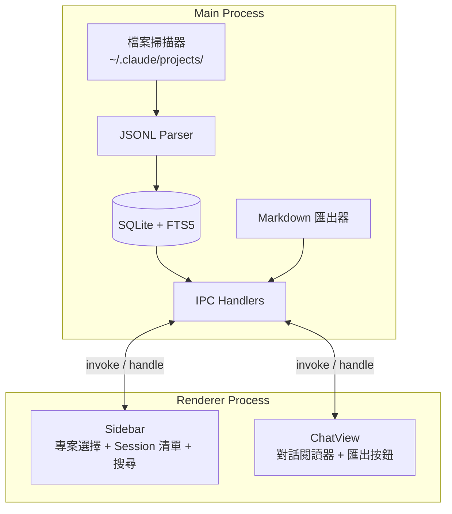

# ccRewind

[](https://www.gnu.org/licenses/agpl-3.0)
[](https://www.typescriptlang.org/)
[](https://reactjs.org/)
[](https://www.electronjs.org/)

[English](README_EN.md)

Claude Code 對話回放與考古工具——輕量、只讀、離線優先的桌面應用程式，讓你回顧與 Claude Code 的每一次協作對話。

<p align="center">
  
</p>

---

## 核心概念

ccRewind 讀取 `~/.claude/projects/` 下的 JSONL 對話紀錄，建立 SQLite + FTS5 索引，提供瀏覽、搜尋、匯出功能。

不做 AI 摘要、不做 context injection、不做 RAG。讓資料自己說話。

所有操作都是唯讀的——ccRewind 絕不修改 `~/.claude/` 下的任何檔案。你的對話紀錄、記憶檔案、設定檔，一個位元組都不會動。

---

## 功能特色

| 功能 | 說明 |
|------|------|
| **對話瀏覽** | user/assistant 氣泡介面，Markdown 渲染 + 程式碼語法高亮 |
| **Tool 摺疊** | tool_use / tool_result 預設摺疊，點擊展開查看完整內容 |
| **全文搜尋** | FTS5 索引，支援全部專案 / 目前專案範圍切換，點擊跳轉 + 高亮 |
| **Markdown 匯出** | 一鍵將 session 匯出為 `.md` 檔案，含 metadata 表格 + tool 摺疊 |
| **增量索引** | 首次啟動掃描所有 JSONL，後續僅處理新增/修改的檔案 |
| **虛擬捲動** | 大量 session 不卡頓（@tanstack/react-virtual） |

---

## 系統架構



---

## 技術棧

| 技術 | 用途 | 備註 |
|------|------|------|
| Electron 33 | 桌面應用框架 | macOS hiddenInset title bar |
| React 19 | UI 框架 | 函式元件 + hooks |
| TypeScript 5.9 | 型別安全 | strict mode |
| better-sqlite3 11 | SQLite binding | 含 FTS5 全文搜尋 |
| electron-vite 5 | 建構工具 | main + preload + renderer 三路建構 |
| Vitest 3 | 測試框架 | 66 個測試，透過 Electron 執行 |

---

## 快速開始

### 環境需求

- Node.js >= 20, < 23
- pnpm >= 9

### 安裝與啟動

```bash
git clone https://github.com/tznthou/ccRewind.git
cd ccRewind
pnpm install
pnpm dev
```

### 建構發布

```bash
pnpm build
pnpm dist
```

### 其他指令

```bash
pnpm test        # 執行測試（透過 Electron 跑 Vitest）
pnpm typecheck   # TypeScript 型別檢查
pnpm lint        # ESLint 修正
```

---

## 專案結構

```
ccRewind/
├── src/
│   ├── main/                  # Electron main process
│   │   ├── index.ts           # 應用程式入口
│   │   ├── scanner.ts         # 專案 / session 檔案掃描
│   │   ├── parser.ts          # JSONL 解析器
│   │   ├── database.ts        # SQLite + FTS5 管理
│   │   ├── indexer.ts         # 增量索引器
│   │   ├── exporter.ts        # Markdown 匯出
│   │   └── ipc-handlers.ts    # IPC 通訊處理
│   ├── preload/               # contextBridge 安全橋接
│   │   └── index.ts
│   ├── renderer/              # React 前端
│   │   ├── App.tsx            # 根元件
│   │   ├── components/
│   │   │   ├── Sidebar/       # 專案選擇 + Session 清單 + 搜尋
│   │   │   └── ChatView/      # 對話閱讀器 + 匯出按鈕
│   │   ├── hooks/             # useSession, useSessions, useProjects
│   │   └── context/           # AppContext（useReducer 狀態管理）
│   └── shared/
│       └── types.ts           # 主程序與渲染程序共用型別
├── tests/                     # Vitest 測試（66 個）
├── docs/                      # PRD / SPEC / PLAN
├── electron-builder.yml
└── package.json
```

---

## 隨想

### 為什麼做這個

跟 Claude Code 協作的對話散落在 `~/.claude/projects/` 底下，每個 session 是一個 JSONL 檔案。想回頭看三天前的設計決策？得記得是哪個 session、手動 `cat` JSONL、在密密麻麻的 JSON 裡找到那段對話。

現有的方案要嘛太重（RAG、向量搜尋），要嘛方向不對（記憶注入、context 管理）。我只是想安靜地回顧過去的對話，像翻閱考古現場的筆記本一樣。

所以 ccRewind 就是這個：一本有索引的考古筆記本。

### Non-goals

ccRewind 刻意不做這些事：

- **不做 AI 摘要**——讓你自己讀原文，不替你決定什麼重要
- **不做 context injection**——不干預未來的對話，只回顧過去的
- **不做雲端同步**——所有資料來自本地 `~/.claude/`，不上傳任何東西
- **不修改任何檔案**——純唯讀應用，連 `~/.claude/` 的 mtime 都不會動
- **不做即時監控**——不是 tail -f，是考古學

如果你需要的是「讓 Claude 記住之前說過什麼」，去看 claude-mem 之類的記憶系統。ccRewind 解決的是不同的問題：讓人類回顧與 AI 的協作歷史。

---

## 授權

本專案採用 [AGPL-3.0](LICENSE) 授權。

---

## 作者

子超 (tznthou) — [tznthou.com](https://tznthou.com)
