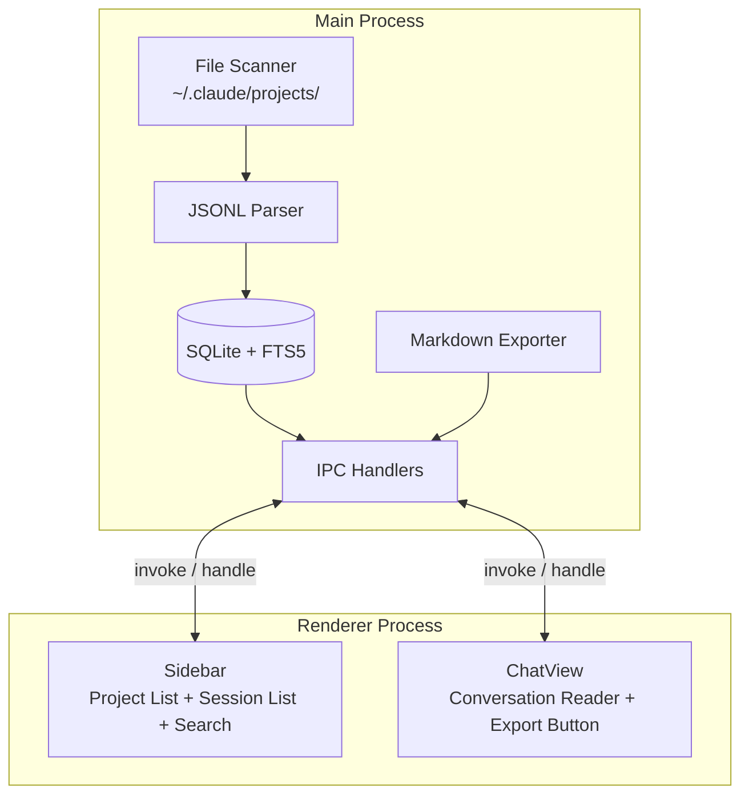

# ccRewind

[](https://www.gnu.org/licenses/agpl-3.0)
[](https://www.typescriptlang.org/)
[](https://reactjs.org/)
[](https://www.electronjs.org/)

[中文](README.md)

A lightweight, read-only, offline-first desktop app for browsing your Claude Code conversation history.

<p align="center">
  
</p>

<p align="center">
  
  
</p>

---

## Core Concept

ccRewind reads JSONL conversation logs from `~/.claude/projects/`, builds a SQLite + FTS5 index, and provides browsing, searching, and exporting capabilities.

No AI summaries. No context injection. No RAG. Let the data speak for itself.

Everything is read-only — ccRewind never modifies any file under `~/.claude/`. Your conversations, memory files, and settings remain untouched. Not a single byte.

---

## Features

| Feature | Description |
|---------|-------------|
| **Conversation Browser** | User/assistant bubble UI with Markdown rendering + syntax highlighting |
| **Tool Collapsing** | tool_use / tool_result blocks collapsed by default, click to expand |
| **Full-Text Search** | FTS5 index with pagination, results grouped by session, all-projects / current-project scope toggle |
| **Data Preservation** | Automatically archives conversations when JSONL files are deleted — no history is ever lost |
| **Markdown Export** | One-click export session to `.md` with metadata table + tool `<details>` blocks |
| **Update Notification** | Detects new GitHub releases on launch, one-click to open download page |
| **Incremental Indexing** | Scans all JSONL on first launch, processes only new/modified files afterwards |
| **Auto DB Migration** | Schema changes applied automatically on startup, seamless upgrades for large databases |
| **Virtual Scrolling** | Handles large session lists smoothly (@tanstack/react-virtual) |

---

## Architecture



---

## Tech Stack

| Technology | Purpose | Notes |
|------------|---------|-------|
| Electron 33 | Desktop app framework | macOS hiddenInset title bar |
| React 19 | UI framework | Function components + hooks |
| TypeScript 5.9 | Type safety | Strict mode |
| better-sqlite3 11 | SQLite binding | With FTS5 full-text search |
| electron-vite 5 | Build tool | Triple build: main + preload + renderer |
| Vitest 3 | Test framework | 86 tests, run through Electron |

---

## Quick Start

### Prerequisites

- Node.js >= 20, < 23
- pnpm >= 9

### Install & Run

```bash
git clone https://github.com/tznthou/ccRewind.git
cd ccRewind
pnpm install
pnpm dev
```

### Build for Distribution

```bash
pnpm build
pnpm dist
```

### Other Commands

```bash
pnpm test        # Run tests (Vitest via Electron)
pnpm typecheck   # TypeScript type check
pnpm lint        # ESLint auto-fix
```

---

## Project Structure

```
ccRewind/
├── src/
│   ├── main/                  # Electron main process
│   │   ├── index.ts           # App entry point
│   │   ├── scanner.ts         # Project / session file scanner
│   │   ├── parser.ts          # JSONL parser
│   │   ├── database.ts        # SQLite + FTS5 management
│   │   ├── indexer.ts         # Incremental indexer
│   │   ├── exporter.ts        # Markdown export
│   │   ├── updater.ts         # GitHub Release update checker
│   │   └── ipc-handlers.ts    # IPC communication handlers
│   ├── preload/               # contextBridge security bridge
│   │   └── index.ts
│   ├── renderer/              # React frontend
│   │   ├── App.tsx            # Root component
│   │   ├── components/
│   │   │   ├── Sidebar/       # Project list + session list + search
│   │   │   ├── ChatView/      # Conversation reader + export button
│   │   │   ├── ThemeSwitcher/ # Three-theme toggle
│   │   │   └── UpdateBanner/  # Update notification banner
│   │   ├── hooks/             # useSession, useSessions, useProjects
│   │   └── context/           # AppContext (useReducer state management)
│   └── shared/
│       └── types.ts           # Shared types between main and renderer
├── tests/                     # Vitest tests (86)
├── docs/                      # PRD / SPEC / PLAN
├── electron-builder.yml
└── package.json
```

---

## Reflections

### Why This Exists

Conversations with Claude Code are scattered across `~/.claude/projects/` as JSONL files. Want to revisit a design decision from three days ago? You'd need to remember which session it was, manually `cat` the JSONL, and hunt through walls of JSON to find that exchange.

Existing solutions are either too heavy (RAG, vector search) or solving a different problem (memory injection, context management). I just wanted to quietly revisit past conversations — like flipping through an archaeologist's field notebook.

That's what ccRewind is: an indexed field notebook for AI archaeology.

### Non-goals

ccRewind deliberately does not:

- **No AI summaries** — read the original text yourself; we don't decide what's important for you
- **No context injection** — we don't interfere with future conversations, only look back at past ones
- **No cloud sync** — all data comes from local `~/.claude/`, nothing gets uploaded
- **No file modification** — pure read-only app; we don't even touch the mtime of `~/.claude/`
- **No live monitoring** — this isn't `tail -f`, it's archaeology

If what you need is "make Claude remember what was said before," look at memory systems like claude-mem. ccRewind solves a different problem: letting humans review their collaboration history with AI.

---

## License

This project is licensed under [AGPL-3.0](LICENSE).

---

## Author

tznthou — [tznthou.com](https://tznthou.com)
