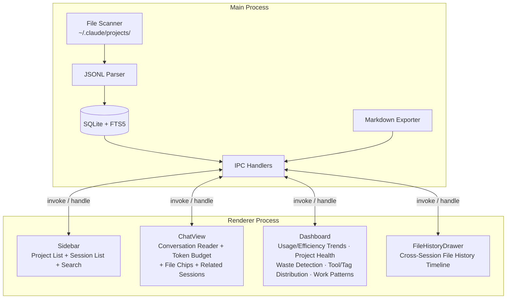

# ccRewind

[](https://www.gnu.org/licenses/agpl-3.0)
[](https://www.typescriptlang.org/)
[](https://reactjs.org/)
[](https://www.electronjs.org/)

[中文](README.md)

A conversation replay and archaeology tool for Claude Code. Lightweight, read-only, offline-first desktop app for browsing your Claude Code conversation history.

<p align="center">
  
</p>

<p align="center">
  
  
</p>

### Three Themes × Context Budget Dashboard

Switch between three visual themes with one click. Built-in token usage dashboard lets you review conversations in style.

<table>
  <tr>
    <td align="center"><strong>📂 Archive</strong></td>
    <td align="center"><strong>🕐 Timeline</strong></td>
    <td align="center"><strong>💻 Terminal</strong></td>
  </tr>
  <tr>
    <td></td>
    <td></td>
    <td></td>
  </tr>
</table>

---

## Core Concept

ccRewind reads JSONL conversation logs from `~/.claude/projects/`, builds a SQLite + FTS5 index, and provides browsing, searching, and exporting capabilities.

Session summaries and tags are currently generated by pure heuristics at zero API cost. A BYOK (Bring Your Own Key) mode is planned for LLM-powered summaries in a future release.

Everything is read-only. ccRewind never modifies any file under `~/.claude/`. Your conversations, memory files, and settings remain untouched. Not a single byte.

When Claude Code deletes a session, ccRewind automatically archives that conversation. All messages, tags, and summaries stay in SQLite and won't disappear with the JSONL file.

---

## Features

| Feature | Description |
|---------|-------------|
| **Conversation Browser** | User/assistant bubble UI with Markdown rendering + syntax highlighting |
| **Three Themes** | Archive, Timeline, and Terminal themes, one-click toggle |
| **Tool Collapsing** | tool_use / tool_result blocks collapsed by default, click to expand |
| **Session Auto-Summary** | Intent extraction, outcome inference (committed/tested/in-progress/quick-qa), multi-signal tags (20+ rules), touched files with operation types, tool usage stats |
| **Full-Text Search** | FTS5 index with pagination, results grouped by session. Two modes: "Messages" (content) and "Tags/Files" (session metadata). Filter by date range (7d/30d/90d) and toggle between relevance or chronological sort |
| **Search Context Preview** | Expand any search result to see 2 surrounding messages without navigating away. Results show session date and outcome status badge |
| **Data Preservation** | Automatically archives conversations when JSONL files are deleted. No history is ever lost |
| **Markdown Export** | One-click export session to `.md` with metadata table + tool `<details>` blocks |
| **Statistics Dashboard** | Usage/efficiency trends, project health (outcome bars + trend arrows), waste detection (high-token low-outcome sessions with click-to-navigate), tool/tag distribution, work pattern heatmap |
| **Cross-Session Archaeology** | File history drawer (which sessions touched a file), related session recommendations (Jaccard similarity), expandable file chips |
| **Context Budget** | Token breakdown (input/output/cache), context growth chart, output intensity heat bar, 5-rule insight engine (spike detection, cache efficiency, growth rate analysis) |
| **Update Notification** | Detects new GitHub releases on launch, one-click to open download page |
| **Active Time** | Session duration prioritizes active time (excluding >5min idle periods), with wall-clock time shown in parentheses. Dashboard averages use active time |
| **Subagent Browser** | Automatically scans and indexes `subagents/*.jsonl` transcripts. Sessions with subagents display clickable chips (agent type + message count); clicking navigates into the subagent conversation with a breadcrumb bar for parent navigation |
| **Accurate Token Stats** | Detects when a single API response is split into multiple JSONL entries and deduplicates via requestId, fixing ~2.3x token inflation |
| **Incremental Indexing** | Scans all JSONL on first launch, processes only new/modified files afterwards. Resumed sessions are automatically UUID-deduplicated, preventing duplicate messages |
| **Auto DB Migration** | Schema changes applied automatically on startup, seamless upgrades for large databases |
| **Virtual Scrolling** | Handles large session lists smoothly (@tanstack/react-virtual) |
| **Accessibility** | WCAG 2.1 AA contrast, ARIA labels, keyboard navigation, focus management |

---

## Usage Guide

### Session Summaries & Tags

Each session is automatically analyzed at index time:

- **Intent summary**: Extracts the first and last user messages to show what the session was about at a glance
- **Auto-tags**: Inferred from conversation keywords, including `bug-fix`, `refactor`, `testing`, `deployment`, `auth`, `ui`, `docs`, `config`
- **Files touched**: Extracted from tool_use calls (Read/Edit/Write), shows which files were actually operated on
- **Tool stats**: Usage frequency like `Read:15, Edit:8, Bash:5`

Tags and file counts appear directly on each session list item. No need to open a session to understand what it covers.

### Search

ccRewind offers two search modes, toggled via radio buttons next to the search bar:

- **Messages** (default): Searches message content. Results are grouped by session. Each result has a ▸ button that expands to show 2 surrounding messages as context preview, so you can judge relevance without navigating away
- **Tags/Files**: Searches session titles, tags, file paths, summaries, and intent. Great for queries like "which session touched auth.ts?" or "show all bug-fix sessions"

Below the search bar, filter controls let you narrow results:

- **Date range**: All / 7 days / 30 days / 90 days for quick temporal filtering
- **Sort order**: Relevance (FTS5 rank) or Newest first (chronological), auto-re-searches on change

Both modes support "All projects / Current project" scope filtering. Search result groups display the session date, and session search results show outcome status badges.

---

## Architecture



---

## Tech Stack

| Technology | Purpose | Notes |
|------------|---------|-------|
| Electron 33 | Desktop app framework | macOS hiddenInset title bar |
| React 19 | UI framework | Function components + hooks |
| TypeScript 5.7 | Type safety | Strict mode |
| better-sqlite3 11 | SQLite binding | With FTS5 full-text search |
| electron-vite 5 | Build tool | Triple build: main + preload + renderer |
| recharts 3 | Chart library | Area, pie, donut charts (Context Budget + Dashboard) |
| Vitest 3 | Test framework | 231 tests, run through Electron |

---

## Quick Start

### Prerequisites

- Node.js >= 20, < 23
- pnpm >= 9

### Install & Run

```bash
git clone https://github.com/tznthou/ccRewind.git
cd ccRewind
pnpm install
pnpm dev
```

### Build for Distribution

```bash
pnpm build
pnpm dist
```

### Other Commands

```bash
pnpm test        # Run tests (Vitest via Electron)
pnpm typecheck   # TypeScript type check
pnpm lint        # ESLint auto-fix
```

---

## Project Structure

```
ccRewind/
├── src/
│   ├── main/                  # Electron main process
│   │   ├── index.ts           # App entry point
│   │   ├── scanner.ts         # Project / session file scanner
│   │   ├── parser.ts          # JSONL parser
│   │   ├── database.ts        # SQLite + FTS5 management (incl. sessions_fts)
│   │   ├── indexer.ts         # Incremental indexer
│   │   ├── summarizer.ts      # Session auto-summary (heuristic)
│   │   ├── exporter.ts        # Markdown export
│   │   ├── updater.ts         # GitHub Release update checker
│   │   └── ipc-handlers.ts    # IPC communication handlers
│   ├── preload/               # contextBridge security bridge
│   │   └── index.ts
│   ├── renderer/              # React frontend
│   │   ├── App.tsx            # Root component
│   │   ├── components/
│   │   │   ├── Sidebar/       # Project list + session list + search
│   │   │   ├── ChatView/      # Conversation reader + Token heat indicators + File Chips + Subagent navigation + export
│   │   │   ├── Dashboard/     # Statistics dashboard: usage/efficiency trends, project health, waste detection, tool/tag distribution, work patterns
│   │   │   ├── Archaeology/   # Cross-session archaeology: FileHistoryDrawer, RelatedSessionsPanel
│   │   │   ├── TokenBudget/   # Context Budget panel: area chart, pie chart, heat bar, Insights
│   │   │   ├── ThemeSwitcher/ # Three-theme toggle
│   │   │   └── UpdateBanner/  # Update notification banner
│   │   ├── hooks/             # useSession, useSessions, useProjects
│   │   ├── utils/             # formatTokens, formatTime, formatDuration, pathDisplay, renderSnippet
│   │   └── context/           # AppContext + ThemeContext (theme persistence)
│   └── shared/
│       └── types.ts           # Shared types between main and renderer
├── tests/                     # Vitest tests (231)
├── docs/                      # PRD / SPEC / PLAN
├── electron-builder.yml
└── package.json
```

---

## Reflections

### Why This Exists

Conversations with Claude Code are scattered across `~/.claude/projects/` as JSONL files. Want to revisit a design decision from three days ago? You'd need to remember which session it was, manually `cat` the JSONL, and hunt through walls of JSON to find that exchange.

Existing solutions are either too heavy (RAG, vector search) or solving a different problem (memory injection, context management). I just wanted to quietly revisit past conversations, like flipping through an archaeologist's field notebook.

That's what ccRewind is: an indexed field notebook for AI archaeology.

### Non-goals

ccRewind deliberately does not:

- **No context injection**: We don't interfere with future conversations, only look back at past ones
- **No cloud sync**: All data comes from local `~/.claude/`, nothing gets uploaded
- **No file modification**: Pure read-only app; we don't even touch the mtime of `~/.claude/`
- **No live monitoring**: This isn't `tail -f`, it's archaeology
- **LLM is always optional**: All core features work without an API key. LLM summaries are a nice-to-have, not a requirement

If what you need is "make Claude remember what was said before," look at memory systems like claude-mem. ccRewind solves a different problem: letting humans review their collaboration history with AI.

### Roadmap

See [docs/PHASE-2-3.md](docs/PHASE-2-3.md) for details.

| Phase | Status | Theme |
|-------|--------|-------|
| 1 | ✅ Done | Foundation: table splitting, data preservation, pagination, grouping |
| 2 | ✅ Done | Session summary (heuristic), search context preview, scope expansion |
| 2.5 | ✅ Done | Context Budget: token usage tracking, area chart, pie chart, heat bar, sorting |
| 2.6 | ✅ Done | Token Insights Engine: auto-interpret charts (spike detection, cache assessment, hot spot marking, trend analysis) |
| 3 | ✅ Done | Summary quality upgrade + file reverse index (cross-session archaeology foundation) |
| 3.5 | ✅ Done | Statistics dashboard + cross-session archaeology UI |
| 4 | ✅ Done | Advanced dashboard: efficiency trends, waste detection, project health |
| 4.5 | ✅ Done | Search UX: date filter, sort toggle, intent_text search, result date & outcome badges |
| 5 | ✅ Done | Active time calculation + subagent indexing + requestId token dedup |
| 5.5 | ✅ Done | Subagent frontend UI: chip navigation + breadcrumb back |
| — | 📋 Future | In-app auto-update (requires Apple Developer ID code signing) |

---

## License

This project is licensed under [AGPL-3.0](LICENSE).

---

## Author

tznthou / [tznthou.com](https://tznthou.com)
