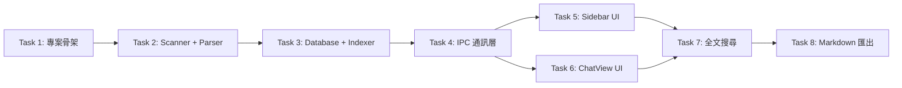

# PLAN.md — ccRewind

## 實作策略

### Build Order

基礎層 → 資料層 → UI 層 → 功能層

先確保能正確解析 JSONL 並存入 SQLite，再建 UI 去呈現。搜尋和匯出是建立在資料層之上的功能，最後做。



Task 5 和 Task 6 可平行開發。

### 測試策略

- 框架選型：Vitest
- 覆蓋率目標：行覆蓋率 ≥ 70%
- 命名慣例：test_<模組>_<功能>_<情境>_<預期>()

### 風險與回退

- JSONL content 結構比預期複雜 → Parser 採用寬容模式，未知結構保留 raw JSON 不中斷
- better-sqlite3 原生模組與 Electron 版本衝突 → 使用 electron-rebuild，或回退至 sql.js（純 WASM）
- 大量 session 首次索引卡頓 → Worker thread 非同步執行 + 進度條

---

## Task 清單

### Task 1: 專案骨架

**目標**：建立 Electron + React + TypeScript + Vite 專案結構，能跑出空白視窗

**影響範圍**：
- Create: `package.json`
- Create: `tsconfig.json`
- Create: `vite.config.ts`
- Create: `electron-builder.yml`
- Create: `src/main/index.ts`
- Create: `src/renderer/App.tsx`
- Create: `src/renderer/index.html`
- Create: `src/shared/types.ts`

**依賴**：無

**驗收條件**：
- Given 專案已建立 → When `pnpm dev` → Then 開啟 Electron 視窗顯示 React 頁面
- Given 專案已建立 → When `pnpm build` → Then 成功打包無錯誤

**測試設計**：
- 正常：test_build_devMode_windowOpens
- 邊界：test_build_production_bundleCreated

**完成信號**：`pnpm dev` 開啟視窗 + `pnpm build` 成功

---

### Task 2: Scanner + Parser

**目標**：掃描 `~/.claude/projects/` 並解析 JSONL 為結構化資料

**影響範圍**：
- Create: `src/main/scanner.ts`
- Create: `src/main/parser.ts`
- Create: `src/shared/types.ts`（擴充 Project, SessionMeta, Message 型別）
- Test: `tests/scanner.test.ts`
- Test: `tests/parser.test.ts`
- Create: `tests/fixtures/sample.jsonl`（測試用範例資料）

**依賴**：Task 1

**驗收條件**：
- Given `~/.claude/projects/` 下有專案資料夾 → When 呼叫 scanner → Then 回傳專案清單含解碼後路徑
- Given JSONL 含 user/assistant/queue-operation/last-prompt → When 解析 → Then 正確分類並提取 content_text
- Given assistant content 為陣列含 text + tool_use blocks → When 解析 → Then text 累加為 content_text，tool_use 標記且記錄 tool name
- Given JSONL 某行格式錯誤 → When 解析 → Then 跳過該行繼續，不中斷

**測試設計**：
- 正常：test_scanner_validProjectDir_returnsProjectList
- 正常：test_parser_userMessage_extractsContentText
- 正常：test_parser_assistantWithToolUse_marksToolUseAndNames
- 邊界：test_scanner_emptyDir_returnsEmptyArray
- 邊界：test_parser_malformedJsonLine_skipsAndContinues
- 邊界：test_parser_contentAsString_handlesDirectly

**完成信號**：所有測試通過 + 能正確解析真實 JSONL 檔案的前 100 行

---

### Task 3: Database + Indexer

**目標**：建立 SQLite schema（含 FTS5），實作首次 / 增量索引

**影響範圍**：
- Create: `src/main/database.ts`
- Create: `src/main/indexer.ts`
- Test: `tests/database.test.ts`
- Test: `tests/indexer.test.ts`

**依賴**：Task 2

**驗收條件**：
- Given 首次啟動 → When indexer 執行 → Then 掃描所有 JSONL 寫入 SQLite，回報進度 0-100%
- Given 已建立索引 → When 有新增 JSONL → Then 增量索引僅處理新增/修改的檔案（比對 file_mtime）
- Given 已建立索引 → When FTS5 查詢某關鍵字 → Then 回傳匹配的 message id 清單

**測試設計**：
- 正常：test_database_createSchema_tablesExist
- 正常：test_indexer_firstRun_indexesAllSessions
- 正常：test_database_fts5Query_returnsMatches
- 邊界：test_indexer_incrementalRun_onlyNewFiles
- 邊界：test_indexer_emptyProject_handlesGracefully

**完成信號**：所有測試通過 + 能對測試 fixtures 建立索引並執行 FTS5 搜尋

---

### Task 4: IPC 通訊層

**目標**：建立 main ↔ renderer 的 IPC channel，實作 contextBridge

**影響範圍**：
- Create: `src/main/ipc-handlers.ts`
- Create: `src/main/preload.ts`
- Modify: `src/main/index.ts`（註冊 IPC handlers + preload）
- Modify: `src/shared/types.ts`（加入 IPC channel 型別）
- Test: `tests/ipc-handlers.test.ts`

**依賴**：Task 3

**驗收條件**：
- Given renderer 呼叫 `projects:list` → When main 處理 → Then 回傳資料庫中的專案清單
- Given renderer 呼叫 `session:load` → When main 處理 → Then 回傳該 session 的完整 Message 陣列
- Given indexer 執行中 → When 進度更新 → Then renderer 收到 `indexer:status` 事件

**測試設計**：
- 正常：test_ipc_projectsList_returnsList
- 正常：test_ipc_sessionLoad_returnsMessages
- 邊界：test_ipc_sessionLoad_invalidId_returnsEmpty

**完成信號**：所有測試通過 + renderer 能透過 IPC 取得資料

---

### Task 5: Sidebar UI

**目標**：專案選擇清單 + Session 清單，含虛擬捲動

**影響範圍**：
- Create: `src/renderer/components/Sidebar/ProjectList.tsx`
- Create: `src/renderer/components/Sidebar/SessionList.tsx`
- Create: `src/renderer/components/Sidebar/index.tsx`
- Create: `src/renderer/hooks/useProjects.ts`
- Create: `src/renderer/hooks/useSessions.ts`

**依賴**：Task 4

**驗收條件**：
- Given 應用程式啟動 → When 載入專案清單 → Then 左側 Sidebar 顯示所有專案名稱
- Given 點擊某專案 → When 載入 session 清單 → Then 顯示按日期倒序排列的 session 清單，含標題與日期
- Given 專案有 100+ sessions → When 捲動清單 → Then 使用虛擬捲動，UI 流暢不卡頓

**測試設計**：
- 正常：test_projectList_render_showsAllProjects
- 正常：test_sessionList_selectProject_showsSessions
- 邊界：test_sessionList_manyItems_virtualScrollWorks

**完成信號**：所有測試通過 + UI 可互動切換專案與 session

---

### Task 6: ChatView UI

**目標**：對話閱讀器，Markdown 渲染 + 程式碼高亮 + tool 摺疊

**影響範圍**：
- Create: `src/renderer/components/ChatView/index.tsx`
- Create: `src/renderer/components/ChatView/MessageBubble.tsx`
- Create: `src/renderer/components/ChatView/ToolBlock.tsx`
- Create: `src/renderer/components/ChatView/MarkdownRenderer.tsx`
- Create: `src/renderer/hooks/useSession.ts`

**依賴**：Task 4

**驗收條件**：
- Given 選擇某 session → When 載入 → Then 以 user（靠左）/ assistant（靠右）交替的氣泡呈現
- Given assistant 訊息含 tool_use → When 顯示 → Then 預設摺疊，顯示 tool 名稱，可點擊展開
- Given 訊息含 Markdown 程式碼區塊 → When 渲染 → Then 有語法高亮

**測試設計**：
- 正常：test_chatView_loadSession_rendersMessages
- 正常：test_toolBlock_collapsed_showsToolName
- 正常：test_toolBlock_expand_showsContent
- 邊界：test_chatView_emptySession_showsPlaceholder

**完成信號**：所有測試通過 + 能完整閱讀真實 session 對話

---

### Task 7: 全文搜尋

**目標**：搜尋列 + 結果清單 + 跳轉定位 + 高亮

**影響範圍**：
- Create: `src/renderer/components/SearchBar/index.tsx`
- Create: `src/renderer/components/SearchBar/SearchResults.tsx`
- Create: `src/renderer/hooks/useSearch.ts`
- Modify: `src/main/ipc-handlers.ts`（加入 search:query handler）
- Modify: `src/renderer/components/ChatView/index.tsx`（加入搜尋高亮與跳轉）

**依賴**：Task 5, Task 6

**驗收條件**：
- Given 輸入關鍵字 → When 搜尋 → Then 顯示匹配的 session 清單含片段預覽
- Given 點擊搜尋結果 → When 跳轉 → Then 載入該 session 並捲動到匹配位置，關鍵字高亮
- Given 搜尋範圍 → When 切換 → Then 可選全部專案或僅目前專案

**測試設計**：
- 正常：test_search_validQuery_returnsResults
- 正常：test_search_clickResult_jumpsToMatch
- 邊界：test_search_noMatch_showsEmptyState
- 邊界：test_search_specialChars_handlesGracefully

**完成信號**：所有測試通過 + 能搜尋到真實 session 中的內容並跳轉

---

### Task 8: Markdown 匯出

**目標**：將 session 匯出為 Markdown 檔案

**影響範圍**：
- Create: `src/main/exporter.ts`
- Modify: `src/main/ipc-handlers.ts`（加入 export:markdown handler）
- Modify: `src/renderer/components/ChatView/index.tsx`（加入匯出按鈕）
- Test: `tests/exporter.test.ts`

**依賴**：Task 6

**驗收條件**：
- Given 閱讀某 session → When 點擊匯出 → Then 開啟系統儲存對話框
- Given 匯出完成 → When 開啟 .md 檔案 → Then 包含 metadata（標題、日期、專案名）+ user/assistant 對話 + tool 以 `<details>` 摺疊
- Given session 含中文內容 → When 匯出 → Then UTF-8 編碼正確

**測試設計**：
- 正常：test_exporter_validSession_generatesMarkdown
- 正常：test_exporter_toolContent_wrappedInDetails
- 邊界：test_exporter_emptySession_handlesGracefully

**完成信號**：所有測試通過 + 匯出的 Markdown 在任何 Markdown viewer 中可正確閱讀

---

### Task 9: Tasks Panel（spike）

**性質**：探索性 spike，不是正式實作 task。目的是驗證 schema、估規模、列出決策點，產出後再判斷是否進入完整實作。

**目標**：在 ccRewind 的 session 詳情中呈現 Claude Code 當時的 TODO 列表（從 `~/.claude/tasks/{sessionId}/*.json` 掃描），讓使用者能回溯「當時想做什麼 / 做到哪 / 卡在哪」。

**動機**：
- Claude Code 2.1.139（2026-05-12）釋出 Agent View，引出 `~/.claude/tasks/` 目錄的存在
- 該目錄以 sessionId 命名子目錄，內含 TaskCreate/TaskUpdate 寫入的 JSON（每個 task 一檔）
- 老 task 不會被清掉（已驗證有 4 月初的 completed 記錄），與 ccRewind「歷史考古」定位天然契合
- 目前 ccRewind 完全沒抓這層資料

**已驗證的 schema**（2026-05-13 實測 `~/.claude/tasks/`）：

```json
{
  "id": "7",
  "subject": "Add SPDX headers to all TS files",
  "description": "src/**/*.ts 和 tests/**/*.ts 首行加 SPDX header",
  "activeForm": "Adding SPDX headers",
  "status": "completed",
  "blocks": [],
  "blockedBy": []
}
```

- status 三態：`pending` / `in_progress` / `completed`（樣本中均出現）
- `blocks` / `blockedBy` 是 task id 陣列，可組依賴圖
- 目錄含 `.lock` 空檔，掃描時要排除
- join key：目錄名 = sessionId，與既有 `sessions` 表天然對應

**影響範圍**（規模估算）：
- Create: `src/main/task-scanner.ts`（類比 `subagent-scanner`）
- Create: `src/main/task-parser.ts`（單檔 JSON.parse + schema validation）
- Modify: `src/main/db.ts`（migration v18：新增 `session_tasks` 表）
- Modify: `src/shared/types.ts`（新增 `ScannedTask` / `SessionTask` 型別，對齊既有 `ScannedSubagent` / `SubagentSession` 命名）
- Modify: `src/main/indexer.ts:245` 附近（在 SUBAGENT SCANNING 區塊之後新增 TASK SCANNING）
- Modify: `src/main/ipc-handlers.ts`（新增 `tasks:listBySession` handler）
- Create: `src/renderer/components/ChatView/TasksPanel.tsx`（類比 `SubagentPanel.tsx`，列表 + status badge）
- Test: `tests/task-scanner.test.ts`、`tests/task-parser.test.ts`

**依賴**：Task 3（DB + Indexer）、Task 6（ChatView UI）

**驗收條件**：
- Given session 有對應 `tasks/{sessionId}/` 目錄 → When 開啟 session → Then TasksPanel 顯示所有 task 與 status
- Given task status 為 `completed` / `in_progress` / `pending` → When 渲染 → Then 三態視覺區分
- Given task 含 `blockedBy` → When 渲染 → Then 顯示依賴關係（chip 或連線）
- Given session 無對應 tasks 目錄 → When 開啟 → Then TasksPanel 不渲染（不顯示空殼）
- Given 重新索引、某 task json mtime 變更 → When 增量索引 → Then 對應 task 更新（沿用 subagent 的 mtime 比對策略）
- Given 目錄含 `.lock` 檔 → When 掃描 → Then 忽略不報錯

**測試設計**：
- 正常：test_taskScanner_validSessionDir_returnsTasks
- 正常：test_taskParser_completedTask_capturesStatus
- 正常：test_taskParser_blockedBy_preservesDependencies
- 邊界：test_taskScanner_emptyDir_returnsEmpty
- 邊界：test_taskScanner_lockFileOnly_returnsEmpty
- 邊界：test_taskParser_malformedJson_skipsLine
- 邊界：test_taskParser_unknownStatus_preservesRaw

**Spike 決策點**（2026-05-13 驗證結果）：

1. **歷史粒度** — ✅ 決定：**v1 snapshot only**
   - 證據：a52666bd 連跑兩輪流水線時，task id append（1-5 跑 T6，6-10 跑 T8），**同 task 被 update 是 rewrite 同 N.json**（mtime 變化），Claude Code 端本身就沒有歷史軌跡可挖
   - DB 存「最新 status + 最後一次 mtime」即可，無須 append-only event log

2. **依賴視覺化** — ✅ 決定：**v1 chip 列 id，不做 graph**
   - 證據：實測 100+ task 樣本，`blocks` 和 `blockedBy` **全為空陣列**
   - graph 投資不划算，需要時再升級

3. **sub-agent 的 TaskCreate** — ✅ 決定：**scanner 只需按 parent sessionId join**
   - 證據：sub-agent JSONL 出現的 tool 集合只有 `TaskOutput`（讀取）、**沒有 TaskCreate / TaskUpdate**
   - 主 session JSONL 是唯一 task 寫入來源
   - tasks/ 下 108 個目錄全部 36 字元 UUID，零個 agent id 命名

4. **resume 同 sessionId 行為** — ✅ 決定：**append 模式，DB 加 (sessionId, taskId) 複合 unique key**
   - 證據：a52666bd 同 sessionId 內第二輪流水線 task id 從 6 開始，**不覆寫 1-5**
   - 同 task 被 update 是 rewrite 對應 N.json（id 穩定）
   - 所有 task 目錄 mtime 跨度 ≤ 1 天，未觀察到跨 session 沿用同 sessionId 場景（Claude Code 預設每次 session 新 UUID）

**衍生發現**：大量老 task 目錄是「空殼」（只剩 `.lock`，*.json 為 0），可能是 task 完成後被清。scanner 須容忍空目錄並跳過。

**完成信號**（spike 階段，非正式實作）：
- [ ] schema 已用 ≥3 個真實 session 樣本交叉驗證（含 completed / in_progress / pending、含 blockedBy 非空）
- [ ] 上述 4 個決策點全部有結論（記入本檔或另開 ADR）
- [ ] 規模估算誤差範圍評估完成（樂觀 / 悲觀 LOC 與工時）
- [ ] 決策：進入完整 Task 10 實作 / 延後 / 拒絕，並寫明理由

### Task 10: Degradation Detection v2（spike，POC Day 1 已完成）

**性質**：探索性 spike 接續 `project_degradation_detection_poc` memory（2026-04-22）。Day 1 POC（2026-05-18）已完成資料量化 + parser 盤點 + migration 草案，待過 `/plan-critic --deep` 閘門。

**目標**：把 JSONL 內 `tool_use_result.is_error` 抽進 ccRewind DB，作為「模型降智 / 卡住 session」偵測的核心訊號。

**動機**：
- Memory 第 25 行記載 `is_error` 是「最硬的降智訊號」但 parser 沒抽
- 2026-05-18 量化證實：ccRwind 專案 68.3% session 含 error，跨專案 34.2%（樣本 N=1104，夠分析）
- 6.8% session 有 6+ errors，是「heavy-fail / 繞不出來」候選樣本

**Day 1 POC 結果**（詳：`.draft/is_error-poc-2026-05-18.md`）：

| 維度 | 數字 |
|---|---|
| ccRwind 含 error session | 28/41（68.3%） |
| 跨專案含 error session | 378/1104（34.2%） |
| heavy-fail（>5 errors） | 75/1104（6.8%） |
| Top session error count | ef032cbd: 11 errors / 1165 entries |

**影響範圍**（規模估算）：
- Modify: `src/main/parser.ts:95-97`（tool_result case +1 行讀 `b.is_error`）
- Modify: `src/main/parser.ts:4` ContentResult interface +1 欄位 `toolErrorCount: number`，5 處 return 預設值
- Modify: `src/main/database.ts`（migration v19 加 `messages.tool_error_count` column + 2 INSERT 路徑 + 1 interface + 1 mapper）
- Add: `tests/parser.test.ts`（is_error true / false / missing 三 case）
- Add: `tests/database.test.ts`（v19 migration idempotent）

**依賴**：Task 3（DB + Indexer）、Task 9（v18 baseline）

**驗收條件**：
- Given session 含 `is_error: true` 的 tool_result → When 索引 → Then `messages.tool_error_count` ≥ 1
- Given session 全部 tool_result 都是 success → When 索引 → Then `tool_error_count` = 0
- Given v19 migration 跑兩次 → Then idempotent，不丟資料
- Given 既有 v18 DB 升級到 v19 → Then 新 column 預設 0，下次 reindex 才填真值（不阻塞啟動）

**Spike 決策點**（待過 `/plan-critic` 確認）：

1. **粒度**：per-message 計數 vs session 層級 aggregate？
   - 草案：per-message（messages.tool_error_count），sessions 層級用 SUM 查詢
   - Why：保留分析彈性，aggregate 用既有 idx_messages_session group by 不貴
2. **重 index 策略**：強制 reindex vs 標記髒讓使用者觸發？
   - 草案：不強制，沿用 Resync 按鈕；新 column 預設 0 直到 reindex
   - Why：1104 sessions × 平均 500 entries ≈ 55 萬 messages，重跑要 30-60 秒，啟動阻塞體驗差
3. **訊號分類**：要不要分類 error type（timeout / not_found / permission）？
   - 草案：v1 不分，只存 count；分類進 v2 看 UI 是否需要
   - Why：Memory 警告任務類型 control key 缺失，分類前先確認核心訊號有用
4. **UI 暴露**：v1 是否顯示 error count？
   - 草案：v1 只進 DB 不上 UI，等下個 POC（model × error_rate × file_reedit 三維表）驗證再決定渲染
   - Why：使用者價值閘門未過（零用戶階段優先拉用戶不做進階分析）

**階段規劃**：

- **Phase A：Day 1 POC**（已完成 2026-05-18）
  - [x] is_error 分布量化（ccRwind 68.3% / 跨專案 34.2% / heavy-fail 6.8%）
  - [x] parser 盤點 + migration v19 草案
  - [x] schema 變體驗證（only boolean `true`/`false`，零字串態 / 零數字態）

- **Phase B：閘門**（已完成 2026-05-18）
  - [x] `/plan-critic --deep` 過閘（2 WARN 0 FAIL）
  - [x] 4 項 fixup 完成（schema 變體驗證 / Phase 拆分 / rollback note / 嚴格 === true）
  - [x] 4 個 spike 決策點全部結論定案（per-message 計數 / 不強制 reindex / v1 不分類 / v1 不上 UI）
  - [x] 決策：進入 Phase C（已執行）

- **Phase C：實作**（已完成 2026-05-18）
  - [x] parser.ts 抽 is_error → toolErrorCount（5 處 return 預設值補齊 + `=== true` 嚴格判斷）
  - [x] database.ts migration v19 + 2 INSERT path + 2 SELECT path + MessageRow + MessageInput + mapMessageRow
  - [x] indexer.ts toMessageInputs 帶 toolErrorCount
  - [x] tests/parser.test.ts +3 case（true / false / mixed 含 truthy 變體）
  - [x] tests/database.test.ts +3 case（column schema / round-trip / backward compat）
  - [x] pnpm tsc 雙跑（node + web）全綠 + pnpm test 458/458 全綠（baseline 452 +6）

- **Phase D：下個 POC**（過 Phase C + 一週實際資料才評估，不在本 Task 範圍）
  - [ ] model × avg_error_rate × file_reedit 三維表
  - [ ] 評估是否上 UI（v1 不上 UI 決策保留）
  - [ ] 過使用者價值閘門才寫成正式功能

### Task 11: GitHub 依賴升級工具接入（Renovate）

**性質**：infra 變更，決策已落定於 [`ADR-003`](./ADR-003-dependency-upgrade-tool.md)。

**目標**：建立 Renovate-based 依賴升級流水線，含 Electron stack 手動 review 閘門 + native/packaging smoke CI。

**動機**：
- 25 個 deps × solo maintainer 沒餘力手動巡邏
- 安全 CVE 沒有自動 patch 通道
- pnpm-lock.yaml 自然漂移無定期 refresh 機制
- Electron 33 + better-sqlite3 native module 升級高風險，要跟其他 deps 分開對待

**決策摘要**（詳 ADR-003）：採 Renovate，不採 Dependabot version PRs，不做 Hybrid 雙 bot。理由：Renovate `dependencyDashboardApproval` 對 Electron stack 是必需、`lockFileMaintenance` 原生對應 pnpm 維護需求、Hybrid 會踩 lockfile contention。

**動工時機**：2026-05-21 後（v1.13.0 Tasks Panel dogfood 滿）

**影響範圍**：
- Add: `.github/renovate.json`（packageRules: Electron stack dashboard approval / TypeScript 拉出 / safe patch automerge / safe minor manual / GitHub Actions 獨立）
- Add: `.github/workflows/electron-smoke.yml`（Electron stack PR 觸發：electron-rebuild + native binding 驗證 + pnpm dist mac+win）
- Modify: `package.json` 加 `"packageManager": "pnpm@<current-version>"` 鎖 pnpm 版本
- Repo settings: branch protection 設 required status checks（vitest / node typecheck / web typecheck / electron-smoke）
- Repo settings: 安裝 Renovate GitHub App + 確認 Dependency Graph + Dependabot alerts 啟用（不啟用 version PRs）

**依賴**：無（infra 變更，獨立於其他 Task）

**驗收條件**：
- Given 提交 PR 升 highlight.js patch → When CI 全綠 → Then Renovate platform automerge 自動 merge
- Given 提交 PR 升 electron major → When 觸發 → Then 進 Dependency Dashboard 等手動勾選，不開 PR
- Given 提交 PR 升 typescript minor → When 觸發 → Then 開 PR 但 automerge: false，等手動 review
- Given Renovate 開的 lockFileMaintenance PR → When 跑 CI → Then mac+win electron-smoke 都過才 merge
- Given GitHub Advisory 出現 ccRewind dep 的 CVE → When Renovate 偵測 → Then 開 security label 的 PR 不受 weekly schedule 限制

**收尾條件**：
- 第一週 PR 行為符合預期（patch automerge + minor manual + Electron dashboard）
- 一個月後評估是否把 safe minor 也放 automerge（觀察 dogfood 是否撞壞）
- 記 follow-up：Renovate 行為若偏離 ADR-003 預期，回 ADR 補 Trigger 並重評

### Task 12: JSONL 樹狀結構完整性（parentUuid / compaction / rewind / version）

**性質**：spike，已過 `/plan-critic --deep`（2026-07-06，1 FAIL 3 WARN，建議全數採納）收斂範圍。A / C / B1 可直接排入實作；B2（rewind 跨檔案血緣）待驗證步驟決定範圍，見下。

**目標**：修正三個透過外部讀者技術審查發現的既有架構缺口。

**動機**：
- dev.to 首發文（Parsing Claude Code's JSONL）留言（Skillselion，2026-07-06）指出三點，經 Explore agent 逐一查證程式碼後全部成立
- 影響真實資料正確性：rewind 分支的 session 在 UI 顯示為兩個互不相干的對話，無法呈現分支關係；compaction summary 混入時間軸、無法辨識子類型；unknown-type 封存缺 schema version，無法回答「這個 shape 是哪個版本引入的」
- `docs/SPEC.md:245` 已自承「全部儲存，不區分子類型」是已知限制，這次是把限制轉成具體修復項

**現況證據**（2026-07-06 查證，Explore agent）：
- `parentUuid` 在 `parser.ts:177` 有解析，但 `indexer.ts:91-119` 轉 `MessageInput` 時未複製，DB 從未有 `parent_uuid` 欄位；全部排序查詢用 `sequence = 陣列索引`（`indexer.ts:92`；`database.ts:1241,1268,1272,1454` 的 `ORDER BY sequence`）
- 全 `src/` 無 `isCompactSummary`/`isSidechain`/`rewind`/`fork` 的對話語意處理；`scanner.ts:64-69` 把每個 `.jsonl` 檔當獨立 session，rewind 分支出的新 sessionId 檔案間無 lineage 關聯；跨檔案唯一機制是 uuid 去重（`indexer.ts:207-213`），非樹狀拼接
- `message_archive` 表（`database.ts:653-656`）恆為兩欄（`message_id`, `raw_json`），從未存過 JSONL 頂層 `version` 欄位；資訊仍在 raw_json 全文內，只是未結構化抽出

**不做什麼**（plan-critic 收斂後排除）：
- 不做 UI 分支樹視覺化。留言者的建議是給「在此資料上建索引的人」的資料庫設計建議，不是 ccRewind 產品需要的 UI 功能
- 排序邏輯暫不改成真正樹狀遍歷；parentUuid 先落地為中繼資料，UI 渲染順序維持既有 sequence，等出現具體案例（使用者回報 rewound session 顯示錯亂）才動排序邏輯
- `version` 欄位不擴及所有 message，只存在 `message_archive`（對應實際回報的問題範圍：unknown-type 封存查無版本）

**影響範圍**：
- Sub-item A（parentUuid 落地，可直接排入實作）：`indexer.ts`（複製欄位）、`database.ts`（migration 加 `parent_uuid` column + index）、`shared/types.ts`
- Sub-item C（version 結構化，可直接排入實作）：`parser.ts`（讀頂層 `version`）、`database.ts`（migration 加 `version` column，僅 `message_archive` 表）
- Sub-item B1（compaction/sidechain 子類型標記，可直接排入實作）：`parser.ts`（讀 `isCompactSummary`/`isSidechain`）、`database.ts`（messages 表加對應欄位）、ChatView（依欄位標記特殊區塊，不做血緣關聯）
- Sub-item B2（rewind 跨檔案血緣，範圍待驗證，見下）：`scanner.ts`（分支關聯機制，做法未定）

**依賴**：Task 3（Database + Indexer）

**B2 驗證步驟**（動工前，取代原決策點「血緣要做多深」）：
找一個實際觸發過 rewind 的 session，比對新 sessionId 檔案首筆 entry 的 `parentUuid`，是否指向舊檔案裡某個既有 uuid：
- 指得到 → 血緣幾乎免費，只需 uuid 全域索引（跨檔案查找），不用新欄位/新機制，併入 A 一起做
- 指不到 → 才需要討論要不要做、用什麼替代方式（例如 mtime 鄰近性當弱關聯提示），值不值得投入

**Backfill 策略**：既有已索引 session 是否強制 reparse 補新欄位，比照 Task 10 的 `SUMMARY_VERSION` 強制 reparse 機制辦理（bump 對應 version 常數，觸發下次啟動時 reparse）。

**版本排程**（2026-07-07 已裁決）：A/C/B1 獨立排入 **v1.18.0**，不跟 Task 9（Tasks Panel 完整實作決策）、Task 10 Phase D（新 POC）綁在同一版本——後兩者各自決策時程未定，不讓 Task 12 等待。

**完成信號**：
- [ ] B2 驗證步驟完成，B 的實際範圍確定（併入 A 或另議）
- [ ] A/C/B1（+ 視 B2 結果）實作完成，隨 v1.18.0 發布

---

## 驗證計畫

### 冒煙測試清單

啟動後快速驗證（< 2 分鐘）：
- [ ] 應用程式啟動，顯示專案清單
- [ ] 選擇專案，顯示 session 清單
- [ ] 選擇 session，顯示完整對話
- [ ] 搜尋關鍵字，顯示結果並可跳轉
- [ ] 匯出 session 為 Markdown，檔案可正確開啟
