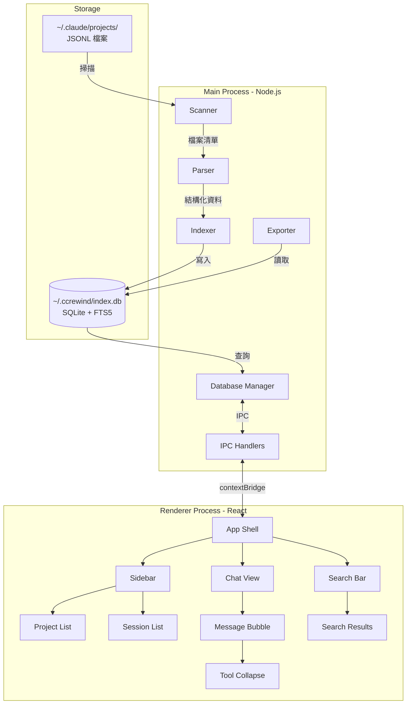

# SPEC.md — ccRewind

## 系統架構



## 模組職責

| 模組 | 職責 | 依賴 |
|------|------|------|
| Scanner | 掃描 `~/.claude/projects/` 目錄結構，列出專案與 JSONL 檔案路徑、大小、修改時間 | Node.js fs |
| Parser | 解析 JSONL 逐行，將 content block 結構化為 Message 物件 | — |
| Database | SQLite 連線管理、schema 建立、CRUD 操作、FTS5 搜尋查詢 | better-sqlite3 |
| Indexer | 首次 / 增量索引調度，進度回報 | Scanner, Parser, Database |
| Exporter | 將 session 資料轉換為 Markdown 字串，處理 tool 摺疊 | Database |
| IPC Handlers | 註冊所有 main ↔ renderer 的 IPC channel | 所有 main 模組 |
| Sidebar | 專案清單 + Session 清單 UI，虛擬捲動 | — |
| ChatView | 對話氣泡渲染，Markdown 渲染 + 程式碼高亮 | — |
| SearchBar | 搜尋輸入 + 結果清單 + 跳轉定位 | — |

## IPC 通訊規格

Main 與 Renderer 之間透過 Electron IPC 通訊。所有 channel 使用 `invoke/handle` 模式（Promise-based）。

### Channel 定義

```yaml
channels:
  projects:list:
    direction: renderer → main
    request: null
    response:
      type: array
      items:
        type: Project
    description: 取得所有專案清單

  sessions:list:
    direction: renderer → main
    request:
      projectId: string
    response:
      type: array
      items:
        type: SessionMeta
    description: 取得某專案下所有 session 清單

  session:load:
    direction: renderer → main
    request:
      sessionId: string
    response:
      type: array
      items:
        type: Message
    description: 載入某 session 的完整對話

  search:query:
    direction: renderer → main
    request:
      query: string
      projectId: string | null
    response:
      type: array
      items:
        type: SearchResult
    description: 全文搜尋

  export:markdown:
    direction: renderer → main
    request:
      sessionId: string
    response:
      type: string
    description: 匯出 session 為 Markdown 字串

  indexer:status:
    direction: main → renderer
    type: event (one-way)
    payload:
      phase: "scanning" | "parsing" | "indexing" | "done"
      progress: number (0-100)
      total: number
      current: number
    description: 索引進度回報
```

## 資料模型

```sql
-- 專案表：對應 ~/.claude/projects/ 下的資料夾
CREATE TABLE projects (
    id TEXT PRIMARY KEY,              -- 資料夾名稱（編碼後路徑）
    display_name TEXT NOT NULL,       -- 解碼後的可讀路徑
    session_count INTEGER DEFAULT 0,
    last_activity_at TEXT,            -- ISO 8601
    created_at TEXT NOT NULL DEFAULT (datetime('now'))
);

-- Session 表：對應每個 JSONL 檔案
CREATE TABLE sessions (
    id TEXT PRIMARY KEY,              -- UUID（檔名）
    project_id TEXT NOT NULL REFERENCES projects(id),
    title TEXT,                       -- 從首筆訊息推導
    message_count INTEGER DEFAULT 0,
    file_path TEXT NOT NULL,          -- JSONL 完整路徑
    file_size INTEGER,               -- bytes
    file_mtime TEXT,                  -- 檔案修改時間（增量索引用）
    started_at TEXT,                  -- 首筆訊息時間
    ended_at TEXT,                    -- 末筆訊息時間
    created_at TEXT NOT NULL DEFAULT (datetime('now'))
);

-- 訊息表：對應 JSONL 中每一行
CREATE TABLE messages (
    id INTEGER PRIMARY KEY AUTOINCREMENT,
    session_id TEXT NOT NULL REFERENCES sessions(id),
    type TEXT NOT NULL,               -- user | assistant | queue-operation | last-prompt
    role TEXT,                        -- user | assistant
    content_text TEXT,                -- 純文字內容（用於顯示與搜尋）
    content_json TEXT,                -- 原始 content JSON（保留結構）
    has_tool_use INTEGER DEFAULT 0,   -- 是否包含 tool_use block
    has_tool_result INTEGER DEFAULT 0,-- 是否包含 tool_result block
    tool_names TEXT,                  -- 使用的 tool 名稱，逗號分隔（Phase 2 統計用）
    timestamp TEXT,                   -- ISO 8601
    sequence INTEGER NOT NULL,        -- 在 session 中的順序
    created_at TEXT NOT NULL DEFAULT (datetime('now'))
);

CREATE INDEX idx_messages_session ON messages(session_id, sequence);
CREATE INDEX idx_sessions_project ON sessions(project_id, started_at DESC);

-- FTS5 全文搜尋虛擬表
CREATE VIRTUAL TABLE messages_fts USING fts5(
    content_text,
    content='messages',
    content_rowid='id',
    tokenize='unicode61'
);

-- FTS5 觸發器：自動同步
CREATE TRIGGER messages_ai AFTER INSERT ON messages BEGIN
    INSERT INTO messages_fts(rowid, content_text) VALUES (new.id, new.content_text);
END;

CREATE TRIGGER messages_ad AFTER DELETE ON messages BEGIN
    INSERT INTO messages_fts(messages_fts, rowid, content_text) VALUES ('delete', old.id, old.content_text);
END;
```

## JSONL 解析規格

### 行結構

每行一個 JSON 物件，依 `type` 欄位分類處理：

| type | 處理方式 |
|------|----------|
| `queue-operation` | 擷取 prompt 作為 session 開頭上下文；提取 timestamp |
| `user` | 解析 content blocks，提取純文字 + 標記 tool_result |
| `assistant` | 解析 content blocks，提取純文字 + 標記 tool_use + 記錄 tool_names |
| `last-prompt` | 標記 session 結束，提取 timestamp |

### Content Block 解析

`user` 和 `assistant` 的 `message.content` 可能是字串或陣列：

```
若為字串 → 直接作為 content_text
若為陣列 → 遍歷每個 block：
  - type: "text" → 累加到 content_text
  - type: "tool_use" → 標記 has_tool_use，記錄 tool name，content_json 保留完整結構
  - type: "tool_result" → 標記 has_tool_result，content_json 保留完整結構
  - 其他 type → content_json 保留，不納入 content_text
```

### UUID 語義與 Resumed Session

每個 JSONL entry 帶有 `uuid` 欄位（全域唯一）。Resumed session 會將先前 entries
（含原始 uuid）replay 到新 .jsonl 檔案中。解析時以 uuid 做跨 session 去重，
避免同一段對話在多個 session 中重複出現。uuid 為 null 的 entries 不參與去重。

### Assistant 回應的 requestId 分塊

單次 API response 可能被拆成多個 `type:"assistant"` entries（每個 content block 一個）。
這些 entries 共享相同 `requestId` / `message.id`，但只有最後一個帶正確的 `output_tokens`。
ccRewind 目前將每個 entry 獨立儲存為一條 message；若未來需要精確 token 統計，
需以 requestId 聚合並取 max output_tokens。

### User Entry 分類

`type:"user"` entries 包含多種語義不同的訊息：

- **人類輸入**：`isSidechain`/`isMeta`/`isCompactSummary` 皆為 falsy
- **tool_result**：content 陣列第一個 block 為 `type:"tool_result"`
- **interrupt marker**：content 以 `[Request interrupted` 開頭
- **compact summary**：`isCompactSummary: true`
- **meta-injected**：`isMeta: true`（system reminder 等）

目前 ccRewind 全部儲存，不區分子類型。

### Subagent 檔案結構（未實作，供參考）

Subagent transcripts 位於 `<project>/<sessionId>/subagents/*.jsonl`，
旁有 `*.meta.json` 記載 `{agentType}`。
檔名格式：`agent-a<label>-<hex>.jsonl`（label 可推斷 agent 類型）。
ccRewind 目前不掃描 subagents/ 目錄。

### Session 標題推導

優先順序：
1. `queue-operation` 的 prompt 前 80 字元
2. 第一筆 `user` 訊息的 content_text 前 80 字元
3. 回退為 session UUID

## 錯誤處理標準

| 情境 | 處理方式 |
|------|----------|
| JSONL 某行 JSON 格式錯誤 | 跳過該行，記錄警告，繼續解析 |
| JSONL 檔案不可讀 | 記錄錯誤，跳過該 session |
| 未知的 type 值 | 以 raw JSON 儲存，不中斷解析 |
| content block 結構異常 | 保留 content_json，content_text 設為空字串 |
| SQLite 寫入失敗 | 交易回滾，記錄錯誤，回報使用者 |
| `~/.claude/` 目錄不存在 | 顯示友善引導訊息 |
